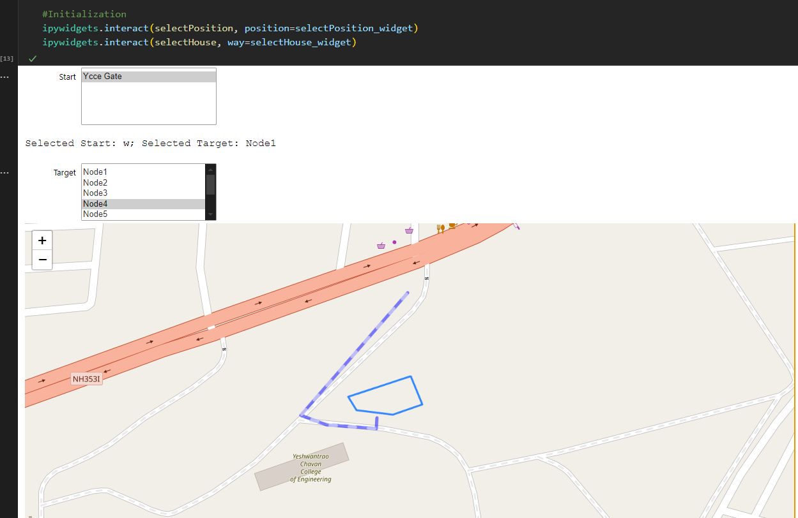
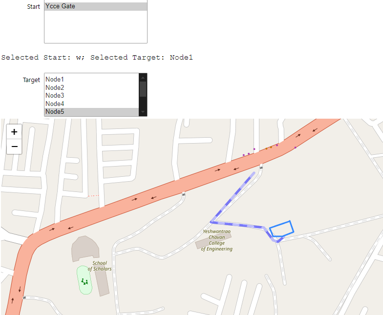

<!-- ## Indoor Navigation System -->
## Problem Statement 
 In large venues such as colleges, universities, hospitals, airports ,railway stations etc , navigating through various departments and public amenities can be challenging for visitors. The lack of navigation systems often leads to confusion and delays, impacting the overall user experience.
## Features
- Interactive 2D & 3D Maps:
- Multi-Platform Access:
- Real-Time Updates & Integration:

#### 2D Plan

#### 3D Model

## Campus Navigation from main gate 

